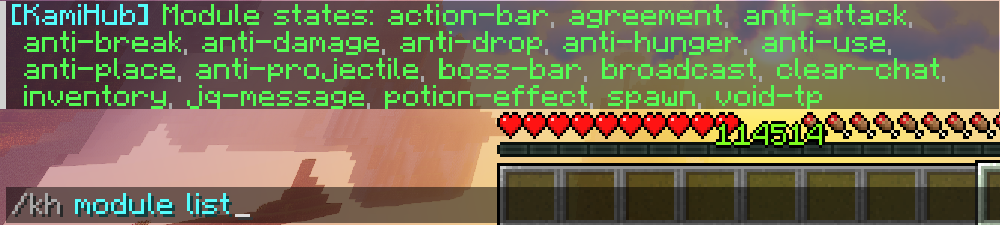

<div align="center">
  <h1>KamiHub</h1>

> Modern Minecraft Server Lobby Management Solution

  <p>

English •
[简体中文](docs/README.zh.md)

  </p>
</div>

## Project Introduction

KamiHub is a multi-functional open-source lobby management plugin, designed specifically for Paper servers. It fully adopts the modern Adventure API and game versions 1.21.4+, providing highly customizable and expandable server lobby management functions.

## Core Features

- **Performance Optimization**: Memory and thread optimization to ensure efficient server operation
- **Hot Reload**: Support for hot reloading of configurations and modules without restarting the server
- **Modular Architecture**: Plug-and-play module design for flexible function expansion
- **Developer API**: Rich API interfaces for convenient secondary development

## Highlights

### Boss Bar Display
> Easy-to-configure multi-world Boss bar display function


### Action Bar Display
> Rich and colorful action bar display function


### Player Agreement System
> Innovative player agreement function, supporting full customization and PAPI variable parsing.


### Modular Management
> Flexible module system, supporting dynamic loading, hot reload, and dependency management.



> > Expected to add hot enable/disable module function in the next version.

## Project Overview

KamiHub is a multi-functional server lobby plugin, providing customizable management solutions for servers through modular design.

### Optional Plugin Support
- **[PlaceholderAPI](https://www.spigotmc.org/resources/6245/)**: Almost globally available dynamic placeholder parsing
- **[LuckPerms](https://luckperms.net/)**: Powerful and easy-to-configure permission management system
- **[Vault](https://www.spigotmc.org/resources/34315/)**: Optional permission group alternative solution

## Related Links

- **GitHub Repository**: [github.com](https://github.com/KamiLand-Network/KamiHub)
- **SpigotMC Page**: [spigotmc.org](https://spigotmc.org/resources/kamihub)
- **Issue Feedback**: [github.com](https://github.com/KamiLand-Network/KamiHub/issues)
- **Discussion Community**: [discord.gg](https://discord.gg/7nN4pVZV4f)

## Dependencies Used

This plugin uses the following dependencies (not included in the plugin itself, source code not modified, only provided at runtime):

> - [Paper API](https://papermc.io) by PaperMC – GPL 3.0 License
> - [Lombok](https://projectlombok.org) by The Project Lombok Authors – MIT License
> - [HikariCP](https://github.com/brettwooldridge/HikariCP) by Brett Wooldridge – Apache-2.0
> - [LiteCommands](https://github.com/Rollczi/LiteCommands) by Rollczi – Apache-2.0
> - [SuperVanish](https://github.com/LeonMangler/SuperVanish) by LeonMangler – MIT License
> - [Item-NBT-API](https://github.com/tr7zw/Item-NBT-API) by tr7zw – MIT License
> - [mysql-connector-j](https://dev.mysql.com) – GPLv2 + FOSS Exception
> - [H2 Database](https://www.h2database.com) – EPL 1.0 / MPL 2.0
> - [bStats](https://github.com/Bastian/bstats-metrics) by Bastian – MIT License
> - [PlaceholderAPI](https://github.com/PlaceholderAPI/PlaceholderAPI) by HelpChat – GPL 3.0 License
> - [LuckPerms API](https://luckperms.net) by Luck – MIT License
> - [Vault API](https://github.com/MilkBowl/Vault) by MilkBowl – LGPL 3.0 License

Sincere thanks to all dependency projects for their contributions to the open source community!

## Open Source License

KamiHub adopts the MIT open source license, allowing free use, modification, and distribution.

```
MIT License

Copyright (c) 2025 KamiLand-Network

Permission is hereby granted, free of charge, to any person obtaining a copy
of this software and associated documentation files (the "Software"), to deal
in the Software without restriction, including without limitation the rights
to use, copy, modify, merge, publish, distribute, sublicense, and/or sell
copies of the Software, and to permit persons to whom the Software is
furnished to do so, subject to the following conditions:

The above copyright notice and this permission notice shall be included in all
copies or substantial portions of the Software.

THE SOFTWARE IS PROVIDED "AS IS", WITHOUT WARRANTY OF ANY KIND, EXPRESS OR
IMPLIED, INCLUDING BUT NOT LIMITED TO THE WARRANTIES OF MERCHANTABILITY,
FITNESS FOR A PARTICULAR PURPOSE AND NONINFRINGEMENT. IN NO EVENT SHALL THE
AUTHORS OR COPYRIGHT HOLDERS BE LIABLE FOR ANY CLAIM, DAMAGES OR OTHER
LIABILITY, WHETHER IN AN ACTION OF CONTRACT, TORT OR OTHERWISE, ARISING FROM,
OUT OF OR IN CONNECTION WITH THE SOFTWARE OR THE USE OR OTHER DEALINGS IN THE
SOFTWARE.

```

---

*KamiHub - Making server lobby management simple and powerful!*
